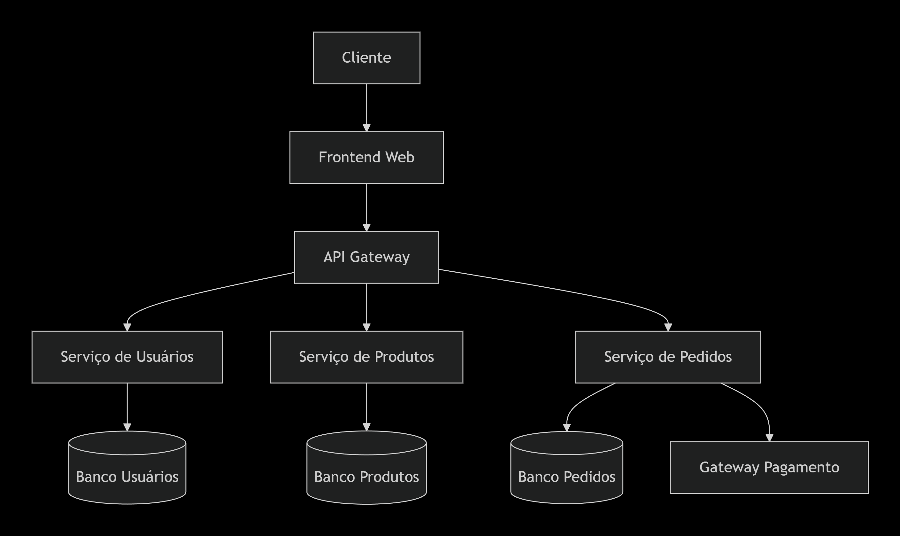

# 🛒 Sistema de E-commerce Integrado – UNIFOR  
### Projeto Final – AV3 · Técnicas de Integração de Sistemas

Este projeto implementa um **sistema de e-commerce fullstack**, composto por:

- **Frontend** (React + Vite)
- **Backend** (Node.js + Express)
- **Banco de Dados** (MongoDB Atlas)
- **Integração com API Externa de Pagamento (Mercado Pago)**

O objetivo é demonstrar, na prática, conceitos de **integração de sistemas**, autenticação, comunicação segura e arquitetura distribuída.

---

# 📌 Arquitetura Geral do Sistema

O sistema possui três camadas principais:

### **1. Frontend (React + Vite)**
- Interface web amigável
- Autenticação JWT
- Listagem e exibição de produtos
- CRUD de produtos (admin)
- Carrinho de compras
- Comunicação com o backend via Axios

### **2. Backend (Node.js + Express)**
- API RESTful
- Autenticação com JWT
- CRUD de produtos
- CRUD de pedidos
- Conexão com MongoDB Atlas
- Integração com Mercado Pago

### **3. Banco de Dados (MongoDB Atlas)**
Coleções:
- `users`
- `products`
- `orders`

---

# 🗂️ Diagrama da Arquitetura



---

# 🛠️ Tecnologias Utilizadas

### **Frontend**
- React
- Vite
- React Router
- Axios
- CSS Puro

### **Backend**
- Node.js
- Express.js
- JWT e Bcrypt
- Mongoose
- Mercado Pago SDK

### **Banco**
- MongoDB Atlas

### **Outras Ferramentas**
- Git/GitHub
- Postman / Insomnia
- Railway / Render (backend)
- Vercel (frontend)

---

# 📁 Estrutura do Projeto

```bash
/
├── backend/
│   ├── src/
│   │   ├── routes/
│   │   ├── models/
│   │   ├── middleware/
│   │   ├── server.js
│   │   └── .env
│   └── package.json
│
├── frontend/
│   ├── src/
│   │   ├── pages/
│   │   ├── components/
│   │   ├── context/
│   │   └── services/
│   └── package.json
│
├── docs/
│   ├── diagrama.png
│   └── projeto-av3.pdf
│
├── README.md
└── .gitignore
